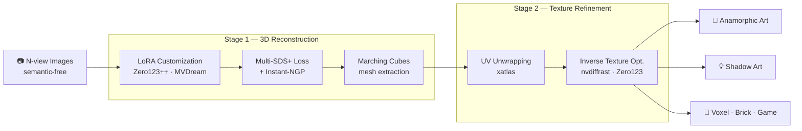

# [SIGGRAPH 2026 Posters] Tex-Shadow

**Tex-Shadow: Synthesizing Textured 3D Shadow Art via 3D-Aware Diffusion Prior**

[Bumsoo Kim<sup>1,†</sup>](https://bumsookim00.com/), [Sanghyun Seo<sup>1,\*</sup>](https://scholar.google.com/citations?user=k1SL428AAAAJ)<br>
<sup>1</sup>Chung-Ang University, Republic of Korea<br>
<sup>†</sup>Derived from his Master's thesis at CAU; now with Smilegate &nbsp;·&nbsp; <sup>\*</sup>Corresponding Author

[](https://gh-bumsookim.github.io/Tex-Shadow/)
[-orange)]()
[](https://github.com/gh-BumsooKim/Tex-Shadow)

---

## Overview

Tex-Shadow is an optimization-based framework that leverages 3D-aware diffusion priors to automate the generation of high-quality **textured** 3D shadow art from sparse multi-view inputs — the first method to support both **colorful anamorphic exhibitions** and **light-projected shadow art**.

## Pipeline



## Method

Tex-Shadow is a hybrid optimization framework with two main stages:

1. **Customization for Semantic-free Inputs** — A pre-trained 3D diffusion model is fine-tuned via LoRA on input image–pose pairs, enabling it to handle heterogeneous (semantic-free) inputs where each view depicts a categorically different subject.

2. **Explicit 3D Reconstruction** — The customized prior guides Instant-NGP via a hybrid Multi-SDS+ loss for 3D-consistent geometry. A subsequent UV-space inverse texture optimization step recovers fine-grained color details through a differentiable rendering pipeline.

The resulting mesh is exported to diverse representations: triangular mesh, voxel grid, density fields, and 3D point cloud.

## Code Release Roadmap

- [ ] Stage 1 — LoRA fine-tuning for semantic-free 3D prior customization
- [ ] Stage 1 — Instant-NGP reconstruction with Multi-SDS+ loss
- [x] Stage 2 — UV-space inverse texture refinement (`code/refinement.py`)

## Acknowledgements

This project builds upon the following excellent open-source works:

- [**DreamGaussian**](https://github.com/dreamgaussian/dreamgaussian) — mesh extraction and texture refinement pipeline
- [**iFusion**](https://github.com/jiawei-ren/iFusion) — Zero123-based diffusion guidance for sparse-view 3D reconstruction

## Citation

```bibtex
@inproceedings{kim2026texshadow,
  title     = {Tex-Shadow: Synthesizing Textured 3D Shadow Art via 3D-Aware Diffusion Prior},
  author    = {Kim, Bumsoo and Seo, Sanghyun},
  booktitle = {SIGGRAPH '26 Posters: ACM SIGGRAPH 2026 Posters},
  year      = {2026},
  address   = {Los Angeles, CA, USA},
  publisher = {ACM}
}
```
